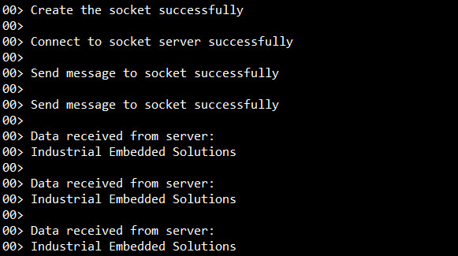
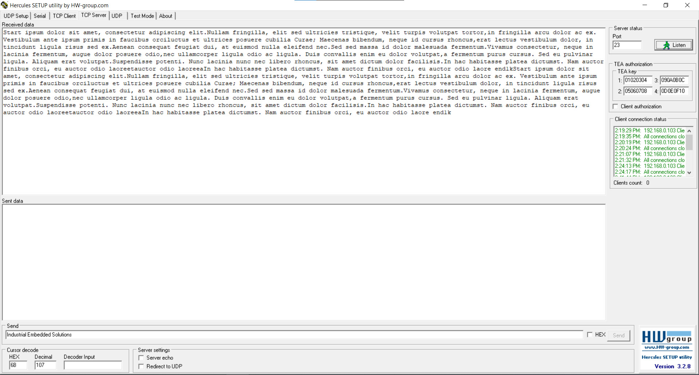
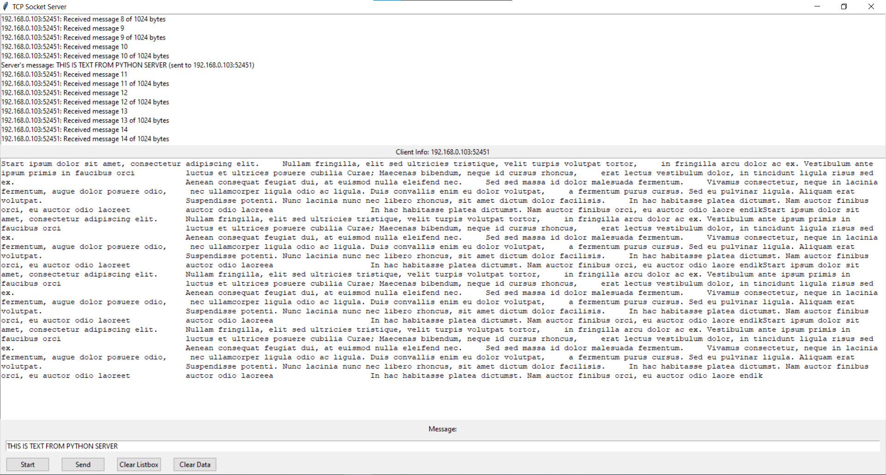

# LWIP Socket Send and Receive Example for STM32

## Introduction

This repository contains an example project that demonstrates how to use the LWIP (Lightweight IP) library on an STM32 microcontroller to send and receive data using socket API. The example showcases the setup and usage of LWIP to establish network communication over Ethernet and demonstrates both server and client functionality.

## Getting Started

### Prerequisites

Before you begin, ensure that you have the following prerequisites:

- STM32 development board with Ethernet connectivity.
- STM32CubeIDE for STM32 development.
- LWIP library installed in your development environment.
- Router with Ethernet ports to configure IP for STM32 development board and server

### Installation

1. Clone this repository to your local machine.
2. Open the project in your preferred STM32 development environment.
3. Configure the necessary settings such as microcontroller selection, linker script, and system clock.

## Project Structure

The project is organized as follows:

- `Core/Src/` : Contains the source code files.
  - `main.c` : Entry point of the application, containing the initialization and main loop .
  - `ethernetif.c` : Ethernet interface initialization and management.
  - `freertos.c` : Freertos application that creates tasks for client to communicate with the server
  - Other application-specific source files.

- `Core/Inc/` : Contains the header files.
  - `main.h` : Main header file with function prototypes and global definitions.
  - Other application-specific header files.

- `LWIP` : Implementing the networking stack and the Ethernet interface .
  - `lwip.c`  : Entry point for initializing and managing the LWIP networking stack.
  - `ethernetif.c`  :  Implement the Ethernet interface for LWIP.

- `MiddleLevel/Network/` : Contains the application code of client example.
  - `socket_client.c` : Demonstrates a client implementation for create a socket, connect to socket server, sending and receiving data over a socket using LWIP.
  - `socket_client.h` : Header file defines data structures, constants, and function prototypes related to the client-side implementation of socket communication using LWIP.

- `MiddleLevel/TestData/test_data.h` : Header file defines data for testing function socket client send.
  
- `SocketServer` : Contains the server socket code file.
  - `socket_server.py` : Create a basic a GUI-based TCP socket server application for handling connections, message exchange, and information display.
  
## Usage

1. Open the project in STM32CubeIDE.
2. Configure the IP address server settings for the client applications in the `socket_client.c` file and the `socket_server.py` file.
3. Build and flash the server and client applications to separate STM32 development boards.
4. Run python socket_server.py or use Hercules SETUP utility to run server application.
5. Use debugging tools to monitor the status of the communication.

## Test result

### Test STM32 client sending data to server and receiving data form server 

### Test server

#### Test server using Hercules tool to check the client connection status, data received from client and send data to client
   

#### Test server using Python application to receive data form client, check the size of data received and send data to client

## Reference
